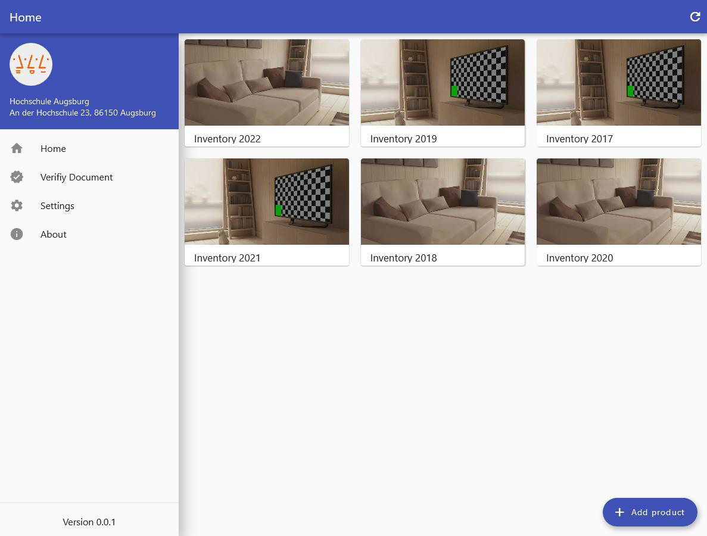

# Inventarverwaltung

This project shows how a popular cross-platform framework such as Flutter can be used to digitize a process such as inventory in a professional context. 
The resulting applications are an app for Android mobile devices and a webapp for desktop devices, the latter running with a standard web browser such as Firefox or Chrome. 

| Main functionality                                                                                                                                                           | Used tools                                                                                                |
| ---------------------------------------------------------------------------------------------------------------------------------------------------------------------------- | --------------------------------------------------------------------------------------------------------- |
| - Inventory management  - Save & Print PDF Protocols  - Verification of PDF documents (Digital Signature)  - Export CSV file  - Locale & shared settings | - Flutter - Firebase Database - Firebase Storage - Firebase Hosting - Material design |

---

## Preview

Home screen - Singlepage Webapp

Overview - mobile app (Android)

